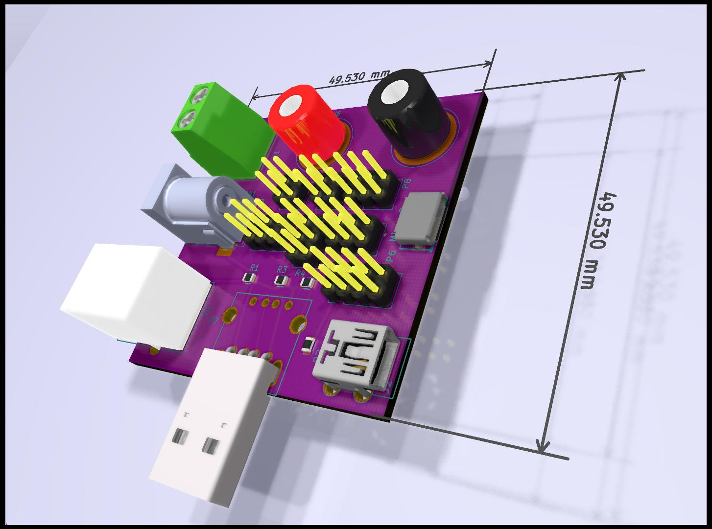
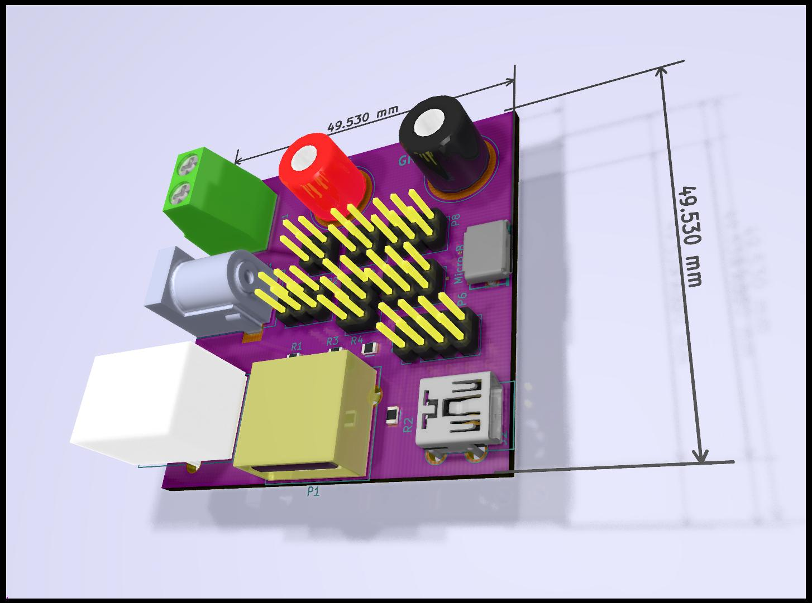
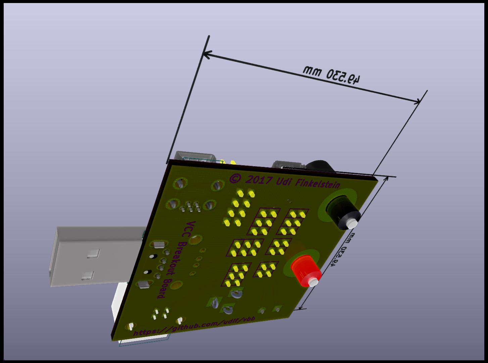
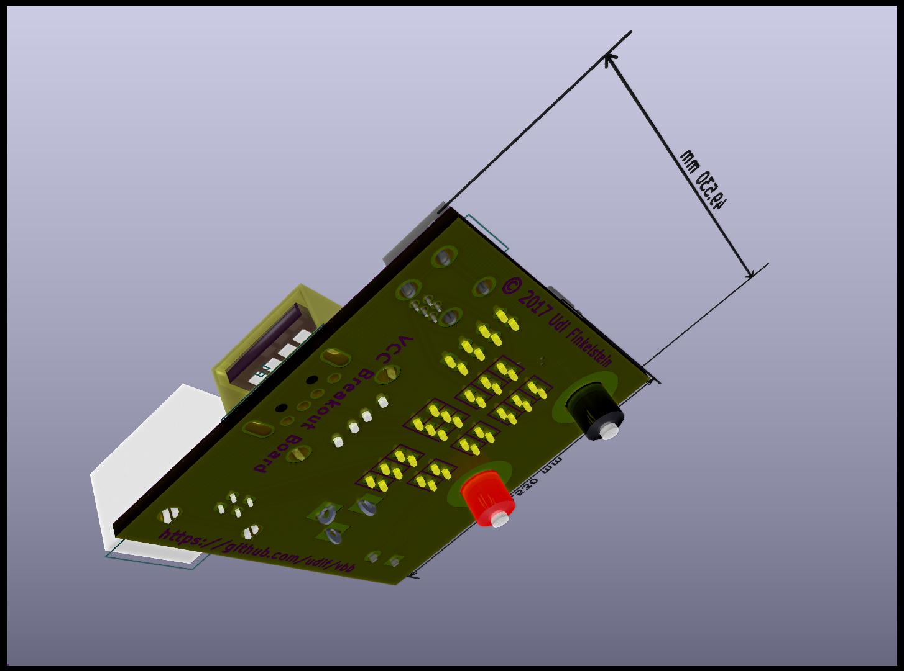

VBB - A VCC Breakout Board
==========================
This board is intended as a VCC breakout board. It supports the following features:
* A wide array of connectors: USB A, B, Micro, Mini, DC plug, Banana Plug, screw terminal.
* While GND is always connected among all connectors, D+/D-/VCC are all switchable via pins.
* Banana plug dimensions match the front panel of Arachnid Lab's Re:Load Pro, and can be mounted directly on it, if one wishes.
* USB-A footprint can be soldered with either a male or female USB-A plug.

Possible uses:
--------------
1. Current measurements by inserting the Banana Plugs in the VCC path between any two connectors.
2. Power supply measurements using standard connectors (USB mini, micro, DC barrel jack) with Re:Load Pro 
3. Controlling of USB D+/D-, either disconnecting it to prevent a data connection, or biasing it with resistors to select a specific charging mode. Some Combinations, such as inserting VBB with two USB-A plugs (male+female) may require 2 PCBs.

TBD
---
* Add VCC/GND/D+/D- marks on the bottom side header pins.
* Possibly add mounting holes
* Next revision will be narrow and long, and support two independent USB-A connectors (male+female), one on each side.

